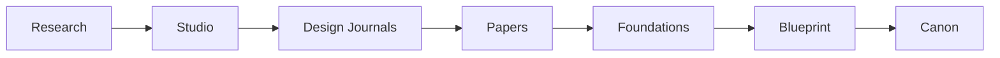

## Homepage Banner (live site)

> Draft copy for the wiki.philpin.com homepage banner, currently hardcoded in `menu-banner.html` on Blot. Captured here so it can be edited in Obsidian, then pasted back into the template. Not yet templated/pulled automatically. Cut material moved to [[Home2]] in 05 Candidates.

**New here? Here's what you're looking at.**

This is a working wiki for Structured Thought — the frameworks, models and ideas I use to think about business and technology. It's built in public, so some pages are thin, some are dense, and both are fine.

A few things worth knowing before you explore:

- **The coloured boxes below** are the tiles — whatever's been added or changed most recently. They're the fastest read on what's alive right now.
- **The hamburger icon** (top right) opens the full menu — atoms, models, concepts, people, and every entry list.
- **Menus aren't always the same.** Some pages carry their own contextual menu suited to that page, so what you see can shift as you move around the site.

Three ways in: [Start Here](https://wiki.philpin.com/start) for a guided path, [About](https://wiki.philpin.com/about) for the why behind this, or hit Surprise Me and let the wiki pick for you.

# Studio

**The thinking is mine. The implementation is Claude's.**

This site, like [philpin.com](https://philpin.com), is built in partnership with Claude (Anthropic). That's a different arrangement from [john.philpin.com](https://john.philpin.com), which is pure hand-crafted human — no AI in the writing or the build (OK - maybe the css 😉). Here, the ideas, the arguments and the judgment calls are mine. The drafting, structuring and editorial mechanics run through Claude, against rules I've set (see [[Studio Constitution]]). Neither replaces the other. They're different tools for different work.

Studio is where that partnership is actually happening.

Not a finished body of work — the live working environment where it's tested, argued with, revised and occasionally discarded. What you're reading is where the thinking currently stands, not a conclusion. If a Concept looks unfinished, it is. That's the point.

## Why this is public

Structured Thought makes a claim about how good thinking gets built. Proving that claim inside a sealed vault would be a contradiction. This wiki is the claim tested in the open — including the parts that aren't tidy: provisional Candidates not yet classified, and the governance running underneath it all, out in the open rather than hidden behind the finished pages.

## Knowledge lifecycle

## Current structure

- **Glossary** is the canonical vocabulary layer.
- **Concepts** hold the named ideas Structured Thought is built from.
- **Papers** contain the working manuscript and remain the authoritative source for Foundations.
- **Principles** define enduring commitments.
- **Models** describe how ideas, knowledge or systems behave.
- **Frameworks** structure how the thinking gets applied.
- **Systems** organise related capabilities and applications.
- **Patterns** capture recurring shapes across the work.
- **Domains** identify enduring areas of activity or concern.
- **Design Journals** preserve developing thought and exploration.
- **Maps** orient across all of the above.
- **Candidates** hold ideas retained for later classification — not yet Primitives, not discarded.

## Begin here

Start with [[000 The World We Inherit]].

## Working rule

The architecture is considered stable enough to test through writing. Structural changes should arise from evidence in the work, not from the search for a theoretically perfect filing system.

## Related

- [[Studio Constitution]]
- [[Architecture Should Emerge]]
- [[Structured Thought]]
- [[Canon]]

<!-- git sync test Fri Sep  4 09:12:53 NZST 2026 -->
